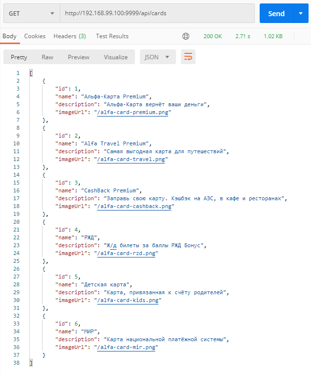

# Домашнее задание к занятию <3.1 Docker>, Докеризация приложения: 

### Задача:
упаковать готовое приложение в образ (т.е. создать Dockerfile и docker-compose.yml).

### Приложение: [db-api-for-docker.jar](https://github.com/netology-code/aqa-homeworks/raw/aqa4/docker/db-api-for-docker.jar)

### Процесс:
- запускаем docker-compose командой: ```docker-compose up -d --build```
- дожидаемся запуска приложения в контеййнере
- проверяем результат путем запроса: ```GET http://localhost:9999/api/cards```

### Результат:


